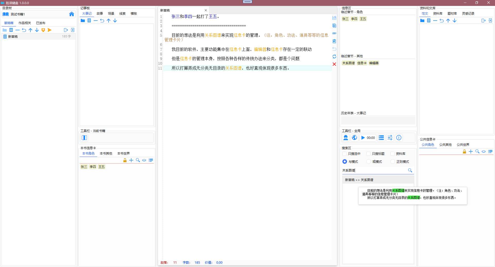

# 脸滚键盘 

## 免责声明

本软件为龙空[此间风物](https://www.lkong.com/user/584564)自制自用的个人写作软件，遵循GPL3开源协议。

本作者**不对使用本软件可能造成的任何负面后果负责**，敬请自行斟酌判断，正确使用。

该版本开源共享是作为demo征集意见和建议，为新一代版本进行需求储备，**后续版本可能涉及到数据库结构的较大改动**，原则上不建议将当前版本作为生产力工具来使用。

>因为各项基本功能业已齐备，实在要用的话也未尝不可，只是需要及时做好资料备份，以及相关数据迁移的心理准备。

## 数据相关和文件格式

>本软件具有简单的导入导出功能，可以将章节保存为`.txt`格式文件

>书籍数据保存在软件`/books`目录下的相关文件里，数据库框架为`sqlite`

>数据库文件为`.db`类型文件，书籍封面为同名`.jpg`文件

>建议配合[坚果云](https://www.jianguoyun.com/)同步盘使用，可以把`/books`文件夹整个同步

## 软件截图

## 联络和反馈方式

龙的天空ID：[此间风物](https://www.lkong.com/user/584564)
>小问题请尽量私信我，比较有价值的，需要发帖讨论，也尽量在[数码科技](https://www.lkong.com/forum/33)版块发帖，不要占用太多公共资源

QQ群：[42355392](https://jq.qq.com/?_wv=1027&k=vDSzU1bF)

GitHub：[Issues](https://github.com/asasn/Scroll-across-the-keyboard-with-your-face/issues)

有意见和建议，或者发现bug，欢迎反馈。

## 简易教程

1.本软件是以“书籍”为基本单位进行操作，初始状态进入软件无书籍，需要自行建立。

>左上角按钮进行新建书籍，删除书籍等等管理

2.在信息卡区域建立角色，其他，世界等等设定集相关信息卡后，可能会消失不见，这是因为默认显示为“当前章节”出现的关键词，也是为了防止载入时卡顿。
>如需对全体成员进行管理，可以点击信息卡区域，那个和添加、搜索按钮同一排的眼睛图案按钮（更多/更少）

>首次展现大量成员可能会卡顿，但之后就不会了（wrappanle面板虚拟化比较麻烦，所以没有使用虚拟化，不像目录树打开几千个节点都不会卡）

3.“设置”那些按钮暂时没有添加内容，不是bug

4.地图功能暂时还不完善，暂时只能添加新地点，未能进行各种编辑

    1.点击“新地图”，使得鼠标光标变成“+”形状
    2.点击地图面板进行标记，可以连续添加多个
    3.右键取消状态，把鼠标变回原状
    
## 其他注意事项

暂时就这么多，其他的想起了再说
